# HRIS Entity Relationship Diagram (ERD)

## Complete Database Schema Visualization

```mermaid
erDiagram
    USERS ||--o{ USER_PROFILES : has
    USERS ||--o{ EMPLOYEES : "registered_as"
    USERS ||--o{ TOKENS : "has_sanctum_tokens"
    USERS ||--o{ AUDIT_LOGS : "performs_actions"
    USERS ||--o{ NOTIFICATIONS : "receives"
    USERS ||--o{ USER_NOTIFICATIONS : "manages"

    EMPLOYEES ||--o{ ATTENDANCE : "has_records"
    EMPLOYEES ||--o{ LEAVES : "requests"
    EMPLOYEES ||--o{ LEAVE_POLICIES : "entitled_to"
    EMPLOYEES ||--o{ LEAVE_BALANCES : "maintains"
    EMPLOYEES ||--o{ PAYROLL : "receives"
    EMPLOYEES ||--o{ PAYROLL_DETAILS : "has_components"
    EMPLOYEES ||--o{ KPIS : "assigned_to"
    EMPLOYEES ||--o{ REIMBURSEMENTS : "submits"
    EMPLOYEES ||--o{ WORK_SCHEDULES : "follows"
    EMPLOYEES ||--o{ EMPLOYEE_DOCUMENTS : "uploads"
    EMPLOYEES ||--o{ TRAINING_ENROLLMENTS : "enrolls_in"
    EMPLOYEES ||--o{ EMPLOYEE_COMPETENCIES : "possesses"
    EMPLOYEES ||--o{ EMPLOYEE_LIFECYCLE_EVENTS : "experiences"
    EMPLOYEES ||--o{ HR_SERVICE_REQUESTS : "creates"
    EMPLOYEES ||--o{ ASSET_ASSIGNMENTS : "assigned_to"
    EMPLOYEES ||--o{ APPROVAL_FLOWS : "participates_in"
    EMPLOYEES ||--o{ APPROVAL_STEPS : "approves_at"

    EMPLOYEES ||--o{ EMPLOYEES : "reports_to_manager"
    EMPLOYEES ||--o{ EMPLOYEES : "assigned_to_dept"
    EMPLOYEES |o--o{ LOCATIONS : "works_at_location"

    ATTENDANCE ||--o{ AUDIT_LOGS : "logged_in"

    LEAVES ||--o{ LEAVE_POLICIES : "uses_policy"
    LEAVES ||--o{ AUDIT_LOGS : "logged_in"

    LEAVE_POLICIES ||--o{ LEAVE_BALANCES : "defines"

    PAYROLL ||--o{ PAYROLL_DETAILS : "contains"
    PAYROLL ||--o{ AUDIT_LOGS : "logged_in"

    KPIS ||--o{ APPROVAL_FLOWS : "requires_approval"
    KPIS ||--o{ AUDIT_LOGS : "logged_in"

    REIMBURSEMENTS ||--o{ APPROVAL_FLOWS : "requires_approval"
    REIMBURSEMENTS ||--o{ AUDIT_LOGS : "logged_in"

    TRAINING_PROGRAMS ||--o{ TRAINING_ENROLLMENTS : "has_enrollments"
    TRAINING_ENROLLMENTS ||--o{ EMPLOYEES : "employee_enrolls"
    TRAINING_PROGRAMS ||--o{ AUDIT_LOGS : "logged_in"

    COMPETENCIES ||--o{ EMPLOYEE_COMPETENCIES : "assigned_via"
    COMPETENCIES ||--o{ AUDIT_LOGS : "logged_in"

    ASSETS ||--o{ ASSET_ASSIGNMENTS : "has_assignments"
    ASSET_ASSIGNMENTS ||--o{ AUDIT_LOGS : "logged_in"

    EMPLOYEE_DOCUMENTS ||--o{ AUDIT_LOGS : "logged_in"

    EMPLOYEE_LIFECYCLE_EVENTS ||--o{ AUDIT_LOGS : "logged_in"

    HR_SERVICE_REQUESTS ||--o{ HR_SERVICE_REQUEST_COMMENTS : "has_comments"
    HR_SERVICE_REQUESTS ||--o{ AUDIT_LOGS : "logged_in"

    APPROVAL_FLOWS ||--o{ APPROVAL_STEPS : "contains_steps"
    APPROVAL_STEPS ||--o{ USERS : "assigned_to_approver"

    ROLES ||--o{ PERMISSIONS : "granted_permissions"
    USERS ||--o{ ROLES : "has_role"
    ROLES ||--o{ AUDIT_LOGS : "role_changes_logged"
    PERMISSIONS ||--o{ AUDIT_LOGS : "permission_changes_logged"

    LOCATIONS ||--o{ WORK_SCHEDULES : "has_schedules"
    LOCATIONS ||--o{ AUDIT_LOGS : "logged_in"

    NOTIFICATIONS ||--o{ USER_NOTIFICATIONS : "sent_to_users"
    AUDIT_LOGS ||--o{ AUDIT_LOGS : "self_documenting"
```



## Detailed Entity Definitions

### Authentication & Authorization Entities

#### USERS
```
Columns:
├─ id (Primary Key)
├─ name (string)
├─ email (unique)
├─ password (bcrypt hashed)
├─ email_verified_at (nullable)
├─ google_id (for SSO)
├─ created_at
└─ updated_at

Indexes:
├─ email (unique)
├─ google_id (unique)
└─ created_at (for reporting)
```

#### USER_PROFILES
```
Columns:
├─ id
├─ user_id (FK → USERS)
├─ full_name
├─ date_of_birth
├─ gender
├─ phone
├─ address
├─ city
├─ province
├─ postal_code
├─ profile_picture_url
├─ bio
├─ emergency_contact_name
├─ emergency_contact_phone
├─ created_at
└─ updated_at
```

#### ROLES
```
Columns:
├─ id
├─ name (unique: employee, manager, hr, admin, super_admin)
├─ description
├─ guard_name (default: api)
├─ is_active
├─ created_at
└─ updated_at
```

#### PERMISSIONS
```
Columns:
├─ id
├─ name (unique: view_payroll, approve_leave, etc)
├─ description
├─ guard_name
├─ module (attendance, payroll, leave, etc)
├─ action (create, read, update, delete, approve)
├─ created_at
└─ updated_at
```

#### ROLE_PERMISSION (Pivot Table)
```
Columns:
├─ role_id (FK)
├─ permission_id (FK)
└─ Primary Key: (role_id, permission_id)
```

#### USER_ROLE (Pivot Table)
```
Columns:
├─ user_id (FK)
├─ role_id (FK)
├─ assigned_at
├─ assigned_by (user_id of assigner)
├─ assigned_reason
├─ expires_at (nullable)
├─ is_active
└─ Primary Key: (user_id, role_id)
```

### Core Employee Entities

#### EMPLOYEES
```
Columns:
├─ id
├─ user_id (FK → USERS, unique)
├─ employee_code (unique)
├─ department
├─ position
├─ manager_id (FK → EMPLOYEES, nullable)
├─ location_id (FK → LOCATIONS)
├─ salary_grade
├─ cost_center
├─ status (active, on_leave, on_probation, suspended, inactive)
├─ hire_date
├─ separation_date (nullable)
├─ contract_type (permanent, contract, temporary, intern)
├─ employment_type (full-time, part-time)
├─ created_at
└─ updated_at

Indexes:
├─ employee_code (unique)
├─ manager_id
├─ location_id
├─ status
└─ hire_date
```

#### LOCATIONS
```
Columns:
├─ id
├─ name (unique)
├─ country
├─ city
├─ address
├─ postal_code
├─ phone
├─ email
├─ head_of_location_id (FK → EMPLOYEES, nullable)
├─ facilities_info (JSON)
├─ is_active
├─ created_at
└─ updated_at
```

#### WORK_SCHEDULES
```
Columns:
├─ id
├─ name
├─ location_id (FK → LOCATIONS)
├─ working_days (JSON: [1,2,3,4,5]) → Mon-Fri
├─ start_time (format: HH:MM)
├─ end_time (format: HH:MM)
├─ break_duration (minutes)
├─ lunch_start_time
├─ lunch_end_time
├─ shift_rotation (nullable, JSON)
├─ is_active
├─ created_at
└─ updated_at
```

### Attendance Entities

#### ATTENDANCE
```
Columns:
├─ id
├─ employee_id (FK → EMPLOYEES)
├─ date
├─ check_in_time (nullable)
├─ check_out_time (nullable)
├─ status (present, absent, late, permission, holiday)
├─ total_hours (calculated)
├─ is_overtime
├─ overtime_hours (decimal)
├─ is_approved
├─ approved_by_id (FK → USERS, nullable)
├─ notes
├─ created_at
└─ updated_at

Indexes:
├─ employee_id, date (composite unique)
├─ status
├─ date
└─ is_overtime
```

### Leave Entities

#### LEAVE_POLICIES
```
Columns:
├─ id
├─ name (Annual, Sick, Unpaid, Maternity, etc)
├─ policy_code (unique)
├─ entitlement_type (fixed, accrual, unlimited)
├─ entitlement_value (days per year)
├─ accrual_method (monthly, yearly, immediate)
├─ max_carryover_days
├─ carryover_expiry_months
├─ min_leave_duration (days)
├─ max_consecutive_leave (days)
├─ approval_chain (JSON)
├─ blackout_dates (JSON or separate table)
├─ is_paid (salary calculation)
├─ is_active
├─ created_at
└─ updated_at
```

#### LEAVES
```
Columns:
├─ id
├─ employee_id (FK → EMPLOYEES)
├─ leave_policy_id (FK → LEAVE_POLICIES)
├─ leave_type_id (for reference)
├─ start_date
├─ end_date
├─ duration (calculated days)
├─ reason
├─ status (pending, approved, rejected, cancelled)
├─ approved_by_manager_id (FK → EMPLOYEES, nullable)
├─ approved_by_hr_id (FK → USERS, nullable)
├─ approval_notes
├─ is_attachment_required
├─ attachment_url (nullable)
├─ contingency_plan (nullable)
├─ created_at
└─ updated_at

Indexes:
├─ employee_id, status
├─ start_date, end_date
├─ status
└─ created_at
```

#### LEAVE_BALANCES
```
Columns:
├─ id
├─ employee_id (FK → EMPLOYEES)
├─ leave_policy_id (FK → LEAVE_POLICIES)
├─ financial_year (YYYY)
├─ opening_balance (days)
├─ accrued_till_date (days)
├─ utilized_days (calculated)
├─ available_days (calculated)
├─ carryover_days (from previous year)
├─ carryover_expiry_date
├─ forfeited_days
├─ restored_days (appeal/reinstatement)
├─ encashed_days (on separation)
├─ last_updated_at
├─ financial_year_start
└─ financial_year_end

Indexes:
├─ employee_id, leave_policy_id, financial_year
└─ financial_year
```

### Payroll Entities

#### PAYROLL
```
Columns:
├─ id
├─ employee_id (FK → EMPLOYEES)
├─ period (format: YYYY-MM-01)
├─ basic_salary (decimal)
├─ allowance (HRA, DA, etc - total)
├─ bonus (calculated from KPI)
├─ gross_pay (calculated)
├─ deduction (PF, Insurance, etc - total)
├─ tax (Income Tax - calculated)
├─ other_deductions
├─ net_pay (calculated)
├─ payment_method (bank_transfer, check, cash)
├─ payment_date (nullable)
├─ transaction_id (nullable)
├─ status (draft, approved, paid)
├─ approved_by_id (FK → USERS, nullable)
├─ approved_at (timestamp, nullable)
├─ paid_by_id (FK → USERS, nullable)
├─ remarks
├─ created_at
└─ updated_at

Indexes:
├─ employee_id, period (composite unique)
├─ status
├─ period
└─ payment_date
```

#### PAYROLL_DETAILS
```
Columns:
├─ id
├─ payroll_id (FK → PAYROLL)
├─ type (allowance, deduction, tax, bonus)
├─ name (HRA, Basic, PF, Income Tax, etc)
├─ amount (decimal)
├─ percentage (if applicable)
├─ is_taxable
├─ remarks
├─ created_at
└─ updated_at
```

### KPI & Performance Entities

#### KPIS
```
Columns:
├─ id
├─ employee_id (FK → EMPLOYEES)
├─ created_by_id (FK → EMPLOYEES - manager)
├─ title (Sales Target, Quality Score, etc)
├─ description
├─ target_value (numeric)
├─ target_unit (units, %, days, etc)
├─ weightage (% of overall performance)
├─ difficulty_level (easy, medium, hard)
├─ review_frequency (quarterly, half-yearly, yearly)
├─ start_date
├─ end_date
├─ achievement_value (nullable, once submitted)
├─ achievement_percentage (calculated)
├─ status (draft, published, submitted, reviewed, approved)
├─ submitted_at (nullable)
├─ submitted_by_employee_id (FK, nullable)
├─ reviewed_at (nullable)
├─ reviewed_by_manager_id (FK, nullable)
├─ review_comments
├─ final_score (calculated, nullable)
├─ approval_id (FK → APPROVAL_FLOWS, nullable)
├─ created_at
└─ updated_at

Indexes:
├─ employee_id, end_date
├─ status
└─ review_frequency
```

### Training & Competency Entities

#### TRAINING_PROGRAMS
```
Columns:
├─ id
├─ name
├─ code (unique)
├─ category (technical, soft_skills, compliance, etc)
├─ description
├─ duration_hours
├─ trainer_name
├─ trainer_email
├─ cost_per_employee
├─ location (physical address or online)
├─ capacity (max participants)
├─ start_date
├─ end_date
├─ schedule (JSON)
├─ learning_objectives (JSON)
├─ certifiable (true/false)
├─ certification_validity_months
├─ prerequisites (JSON)
├─ status (draft, active, completed, archived)
├─ created_at
└─ updated_at
```

#### TRAINING_ENROLLMENTS
```
Columns:
├─ id
├─ employee_id (FK → EMPLOYEES)
├─ training_program_id (FK → TRAINING_PROGRAMS)
├─ enrolled_at
├─ enrollment_status (pending, active, completed, failed, dropped)
├─ attendance_percentage
├─ assessment_score (nullable)
├─ completion_date (nullable)
├─ certificate_issued (true/false)
├─ certificate_number (nullable)
├─ feedback_from_trainer (JSON, nullable)
├─ feedback_from_employee (JSON, nullable)
├─ created_at
└─ updated_at

Indexes:
├─ employee_id
├─ training_program_id
└─ enrollment_status
```

#### COMPETENCIES
```
Columns:
├─ id
├─ name
├─ code (unique)
├─ category (technical, behavioral, domain, etc)
├─ description
├─ level (1: basic, 2: intermediate, 3: advanced, 4: expert, 5: master)
├─ assessment_method (exam, practical, portfolio, project, observation)
├─ linked_roles (JSON: array of role requirements)
├─ is_mandatory_for_roles (true/false)
├─ is_active
├─ created_at
└─ updated_at
```

#### EMPLOYEE_COMPETENCIES
```
Columns:
├─ id
├─ employee_id (FK → EMPLOYEES)
├─ competency_id (FK → COMPETENCIES)
├─ proficiency_level (1-5)
├─ assessed_at (date of assessment)
├─ assessed_by_id (FK → USERS, usually manager/admin)
├─ assessment_evidence (URL, document reference)
├─ notes
├─ expiry_date (nullable, for certifications)
├─ renewal_date (nullable)
├─ is_verified
├─ created_at
└─ updated_at

Indexes:
├─ employee_id
├─ competency_id
└─ proficiency_level
```

### Asset Management Entities

#### ASSETS
```
Columns:
├─ id
├─ asset_code (unique)
├─ name (Laptop, Chair, Desk, etc)
├─ category (IT, Furniture, Vehicle, etc)
├─ description
├─ serial_number (unique, nullable)
├─ supplier
├─ cost (decimal)
├─ purchase_date
├─ warranty_expiry_date
├─ useful_life_years
├─ depreciation_method (straight_line, diminishing_value)
├─ insurance_policy_number (nullable)
├─ insurance_expiry_date
├─ location_id (FK → LOCATIONS)
├─ custody_agent_id (FK → EMPLOYEES, initially)
├─ status (new, in_use, maintenance, damaged, lost, disposed)
├─ is_it_asset (true/false - for cyber cleanup)
├─ created_at
└─ updated_at

Indexes:
├─ asset_code (unique)
├─ serial_number (unique)
├─ category
└─ status
```

#### ASSET_ASSIGNMENTS
```
Columns:
├─ id
├─ asset_id (FK → ASSETS)
├─ employee_id (FK → EMPLOYEES)
├─ assigned_at
├─ assigned_by_id (FK → USERS)
├─ condition_at_assignment (new, good, fair, poor)
├─ expected_return_date (nullable)
├─ returned_at (nullable)
├─ condition_at_return (nullable)
├─ damage_description (nullable)
├─ damage_cost (decimal, nullable)
├─ status (active, returned, pending_return)
├─ acknowledgment_signed (true/false)
├─ acknowledgment_url (nullable)
├─ created_at
└─ updated_at

Indexes:
├─ asset_id, status
├─ employee_id, status
└─ returned_at
```

### Document Management Entities

#### EMPLOYEE_DOCUMENTS
```
Columns:
├─ id
├─ employee_id (FK → EMPLOYEES)
├─ document_type (ID, Passport, Degree, License, Medical, etc)
├─ document_number (PAN, Aadhaar, License No, etc)
├─ issue_date
├─ expiry_date (nullable)
├─ issuing_authority
├─ document_url (file path/S3 URL)
├─ verification_status (pending, verified, rejected, expired)
├─ verified_by_id (FK → USERS, nullable)
├─ verification_date (nullable)
├─ rejection_reason (nullable)
├─ remarks
├─ is_mandatory
├─ created_at
└─ updated_at

Indexes:
├─ employee_id
├─ document_type
├─ expiry_date
└─ verification_status
```

### Reimbursement Entities

#### REIMBURSEMENTS
```
Columns:
├─ id
├─ employee_id (FK → EMPLOYEES)
├─ title
├─ description
├─ category (travel, meals, office_supplies, client_entertainment, etc)
├─ amount (decimal)
├─ currency
├─ expense_date
├─ status (draft, submitted, manager_approved, hr_approved, financial_approved, paid, rejected)
├─ submitted_by_id (FK → EMPLOYEES - usually self)
├─ submitted_at
├─ manager_approved_by_id (FK → EMPLOYEES, nullable)
├─ manager_approved_at (nullable)
├─ hr_approved_by_id (FK → USERS, nullable)
├─ hr_approved_at (nullable)
├─ financial_approved_by_id (FK → USERS, nullable)
├─ financial_approved_at (nullable)
├─ reason_for_rejection (nullable)
├─ receipt_path (file URL)
├─ invoice_path (nullable, file URL)
├─ project_code (for cost allocation)
├─ cost_center
├─ payment_method (bank_transfer, cheque, cash)
├─ payment_date (nullable)
├─ transaction_id (nullable)
├─ created_at
└─ updated_at

Indexes:
├─ employee_id, status
├─ status
├─ category
└─ expense_date
```

### Notifications Entities

#### NOTIFICATIONS
```
Columns:
├─ id
├─ type (LeaveApproved, PayrollPosted, LeaveBalance, etc)
├─ title
├─ message
├─ data (JSON: contextual data)
├─ created_at
└─ updated_at
```

#### USER_NOTIFICATIONS
```
Columns:
├─ id
├─ user_id (FK → USERS)
├─ notification_id (FK → NOTIFICATIONS)
├─ read_at (nullable, timestamp)
├─ archived_at (nullable)
├─ created_at
└─ updated_at

Indexes:
├─ user_id, read_at
└─ created_at (for unread count)
```

### Workflow & Approval Entities

#### APPROVAL_FLOWS
```
Columns:
├─ id
├─ entity_type (leave, kpi, reimbursement, etc)
├─ entity_id
├─ initiated_by_id (FK → USERS)
├─ initiated_at
├─ current_step
├─ status (pending, in_progress, approved, rejected)
├─ completion_date (nullable)
├─ created_at
└─ updated_at

Indexes:
├─ entity_type, entity_id
└─ status
```

#### APPROVAL_STEPS
```
Columns:
├─ id
├─ approval_flow_id (FK)
├─ step_number (1, 2, 3, etc)
├─ approver_id (FK → USERS)
├─ approver_role (manager, hr, finance, etc)
├─ required_role (for dynamic assignment)
├─ status (pending, approved, rejected, skipped)
├─ approved_at (nullable)
├─ comments (nullable)
├─ created_at
└─ updated_at

Indexes:
├─ approval_flow_id
└─ approver_id, status
```

### Employee Lifecycle Entities

#### EMPLOYEE_LIFECYCLE_EVENTS
```
Columns:
├─ id
├─ employee_id (FK → EMPLOYEES)
├─ event_type (hire, promotion, transfer, leave_of_absence, separation, etc)
├─ event_date
├─ from_value (previous value: previous position, location, etc)
├─ to_value (new value)
├─ reason
├─ supporting_documents (JSON)
├─ initiated_by_id (FK → EMPLOYEES, usually manager or HR)
├─ approved_by_id (FK → USERS, nullable)
├─ approval_date (nullable)
├─ effective_date
├─ status (pending, approved, completed, cancelled)
├─ remarks
├─ created_at
└─ updated_at

Indexes:
├─ employee_id
├─ event_type
└─ event_date
```

### HR Service Request Entities

#### HR_SERVICE_REQUESTS
```
Columns:
├─ id
├─ created_by_employee_id (FK → EMPLOYEES)
├─ request_type (experience_letter, salary_certificate, address_change, etc)
├─ description
├─ attachments (JSON: file URLs)
├─ priority (low, medium, high, urgent)
├─ assigned_to_user_id (FK → USERS, nullable)
├─ status (open, assigned, in_progress, completed, closed)
├─ assigned_at (nullable)
├─ estimated_completion_date
├─ actual_completion_date (nullable)
├─ completion_notes
├─ created_at
└─ updated_at

Indexes:
├─ created_by_employee_id
├─ status
└─ assigned_to_user_id
```

#### HR_SERVICE_REQUEST_COMMENTS
```
Columns:
├─ id
├─ request_id (FK → HR_SERVICE_REQUESTS)
├─ commented_by_id (FK → USERS)
├─ comment_text
├─ attachment_url (nullable)
├─ created_at
└─ updated_at
```

### Audit Entities

#### AUDIT_LOGS
```
Columns:
├─ id
├─ user_id (FK → USERS)
├─ action (create, read, update, delete, approve, reject)
├─ module (attendance, payroll, leave, employee, etc)
├─ resource_type (Employee, Payroll, Leave, etc)
├─ resource_id
├─ before_values (JSON, for auditable changes)
├─ after_values (JSON, for auditable changes)
├─ ip_address
├─ user_agent
├─ request_url
├─ http_status
├─ error_message (nullable)
├─ is_successful
├─ timestamp
├─ created_at

Indexes:
├─ user_id, created_at
├─ resource_type, resource_id
├─ module, action
├─ timestamp
└─ created_at (for retention/archival)
```

## Relationships Summary

| From | To | Type | Cardinality | Notes |
|------|----|----|---|---|
| USERS | ROLES | Many-to-Many | N:M | Via USER_ROLE pivot |
| ROLES | PERMISSIONS | Many-to-Many | N:M | Via ROLE_PERMISSION pivot |
| USERS | EMPLOYEES | One-to-One | 1:1 | User account for each employee |
| EMPLOYEES | ATTENDANCE | One-to-Many | 1:N | Multiple attendance records |
| EMPLOYEES | LEAVES | One-to-Many | 1:N | Multiple leave requests |
| EMPLOYEES | PAYROLL | One-to-Many | 1:N | Monthly payroll records |
| EMPLOYEES | KPIS | One-to-Many | 1:N | Multiple KPIs assigned |
| EMPLOYEES | REIMBURSEMENTS | One-to-Many | 1:N | Multiple reimbursement claims |
| LEAVE_POLICIES | LEAVES | One-to-Many | 1:N | Multiple leaves per policy type |
| PAYROLL | PAYROLL_DETAILS | One-to-Many | 1:N | Salary components |
| TRAINING_PROGRAMS | TRAINING_ENROLLMENTS | One-to-Many | 1:N | Employee enrollments |
| COMPETENCIES | EMPLOYEE_COMPETENCIES | One-to-Many | 1:N | Skill assignments |
| ASSETS | ASSET_ASSIGNMENTS | One-to-Many | 1:N | Multiple assignments over time |
| LOCATIONS | WORK_SCHEDULES | One-to-Many | 1:N | Location-specific schedules |
| EMPLOYEES | MANAGERS (self) | Many-to-One | N:1 | Reports_to relationship |

## Data Types & Constraints

```
STRING/VARCHAR(255)    → Name, Email, Code, etc
TEXT/LONGTEXT          → Descriptions, Comments, JSON data
INTEGER                → IDs, Counts, Percentages
DECIMAL(10,2)          → Amounts, Salary figures
DATE                   → Dates without time
DATETIME/TIMESTAMP     → With time component
BOOLEAN/TINYINT(1)     → Flags, true/false
JSON                   → Complex nested data
ENUM                   → Fixed list options (status)
URL/VARCHAR(2000)      → File paths, URLs
```

## Indexes for Performance

```
PRIMARY KEYS
├─ All IDs
└─ Speed up lookups

UNIQUE INDEXES
├─ email (USERS)
├─ employee_code (EMPLOYEES)
├─ asset_code (ASSETS)
├─ Leave request (employee_id, period)
├─ Payroll (employee_id, period)
└─ Attendance (employee_id, date)

COMPOSITE INDEXES
├─ employee_id + status
├─ employee_id + date (for range queries)
├─ status + created_at
└─ (resource_type, resource_id) - for audit lookups

FOREIGN KEY INDEXES
├─ All FK columns indexed
└─ For JOIN performance

SEARCH INDEXES
├─ Created_at (for date-based reports)
├─ Updated_at (for sync operations)
├─ Status (for filtering)
└─ name/code fields (for text search)
```

## Query Performance Considerations

```
N+1 QUERY PREVENTION
├─ Use eager loading (with)
│  └─ Example: Employees::with('manager', 'attendance')
├─ Select specific columns
│  └─ Example: select('id', 'name', 'manager_id')
└─ Pagination for large datasets

AGGREGATION OPTIMIZATION
├─ Use database functions (SUM, COUNT, AVG)
├─ Avoid loading all records then computing
├─ Create summary/denormalized tables if needed
└─ Cache results (Redis) for static data

REPORTING QUERIES
├─ Materialized views for complex reports
├─ Batch processing for monthly calculations
├─ Archive old data (> 2 years)
└─ Partition large tables by year/month
```

## Data Retention & Archival

```
ACTIVE DATABASE (Latest 2-3 years)
├─ Employee & location data
├─ Current year payroll, leave, attendance
├─ Current training & competencies
└─ Open HR service requests

COLD STORAGE / ARCHIVE (3-7 years)
├─ Historical payroll records
├─ Old attendance records
├─ Completed leave records
├─ Terminated employee data
└─ Audit logs (7-year requirement)

TO BE DELETED (> 7 years)
├─ Audit logs (after 7 years)
├─ Separated employee data (after agreement)
└─ Temporary/test records
```

---

## Conclusion

This ERD provides a **complete, normalized database schema** for an enterprise HRIS with:
- ✅ **30+ entities** covering all HR domains
- ✅ **Proper normalization** (3NF) to prevent data anomalies
- ✅ **Comprehensive indexes** for query performance
- ✅ **Audit trail** on all operational changes
- ✅ **Flexible workflow** system for approvals
- ✅ **Complete lifecycle** tracking from hire to separation

**Production-ready & scalable!** 🚀

---

**Document Version:** 1.0  
**Last Updated:** April 2026  
**Status:** Complete & Ready for Implementation
