# HRIS Role-Based Process Flows - Visual Diagrams

## 1. EMPLOYEE WORKFLOW FLOWCHART

### Daily Attendance Flow
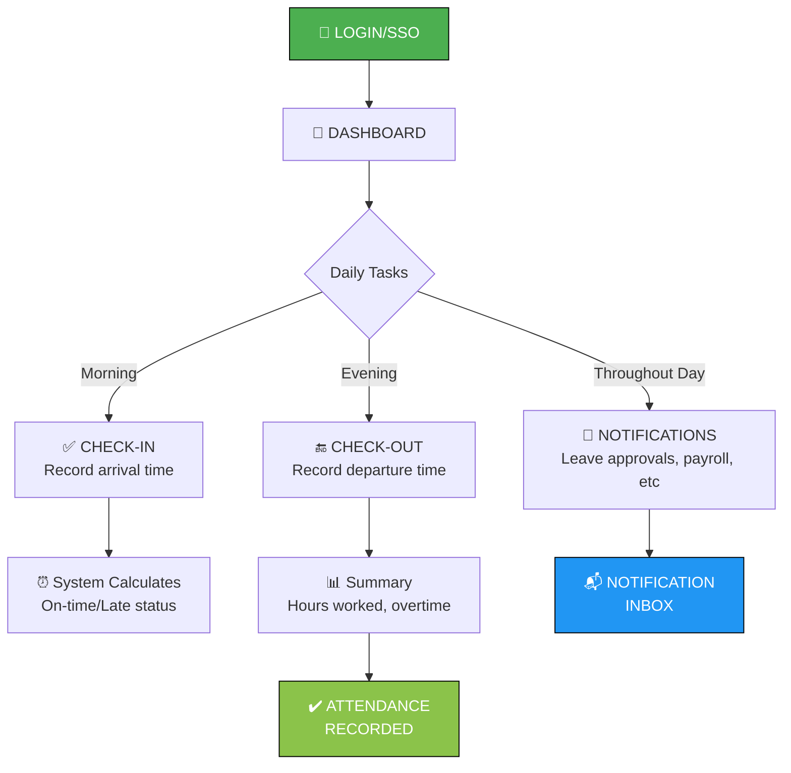

### Leave Request Flow
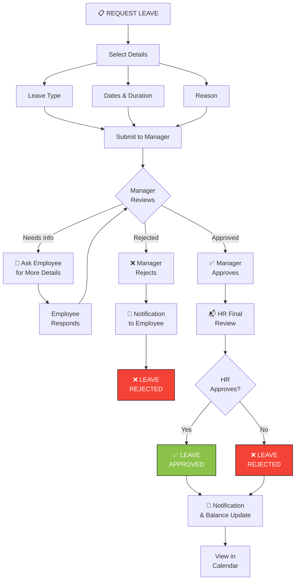

### Payroll Access Flow
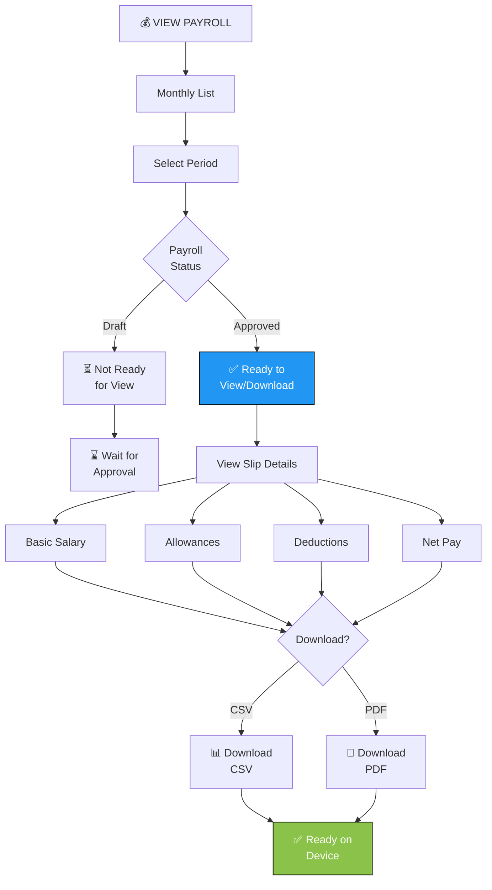

---

## 2. MANAGER WORKFLOW FLOWCHART

### Team Leave Approval Flow
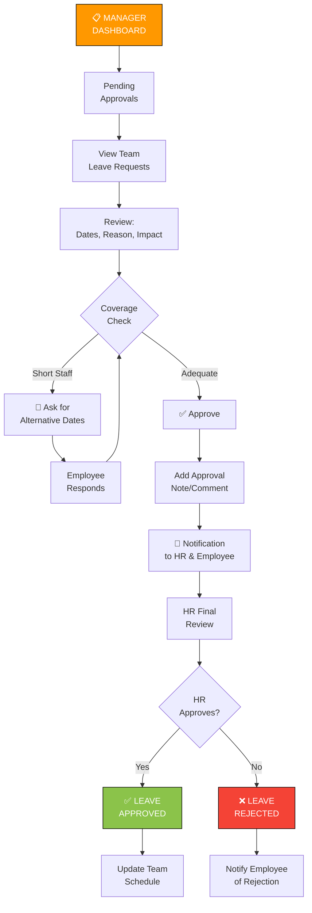

### KPI Review & Approval
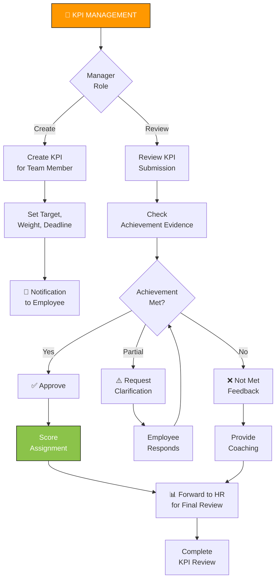

### Team Insights Monitoring
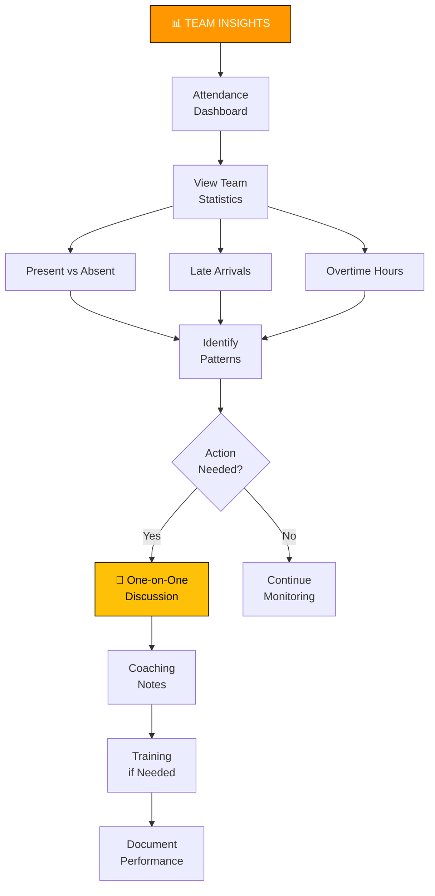

---

## 3. HR OFFICER WORKFLOW FLOWCHART

### Monthly Payroll Processing
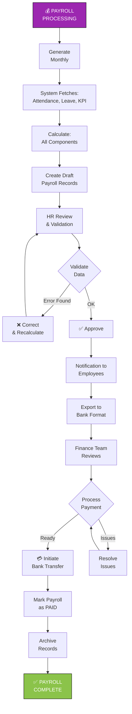

### Employee Onboarding Process
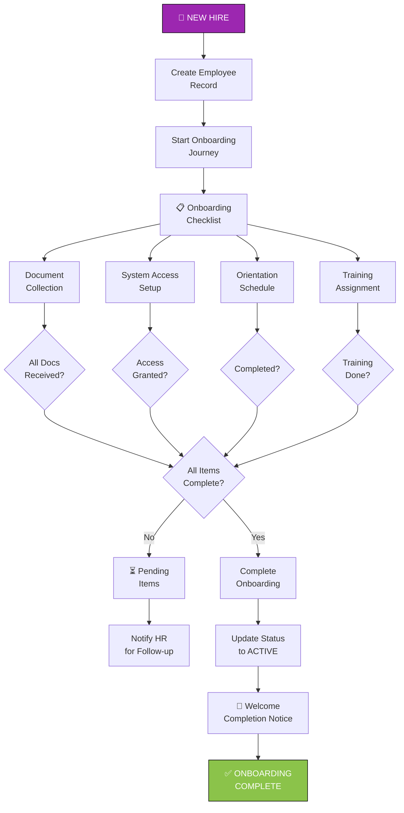

### Training Management Cycle
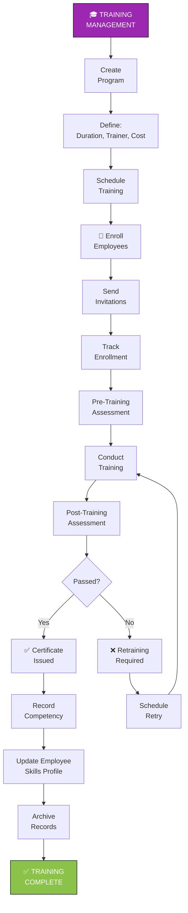

### Leave Policy & Balance Management
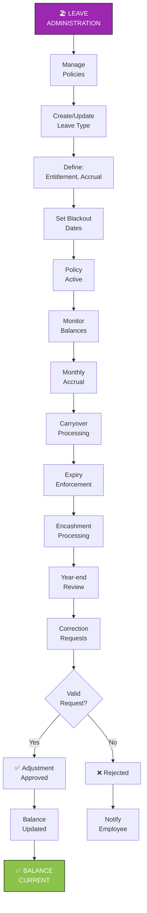

---

## 4. ADMIN WORKFLOW FLOWCHART

### Role & Permission Assignment
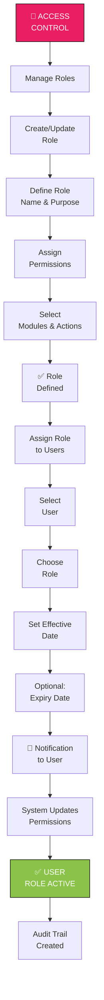

### System Configuration & Monitoring
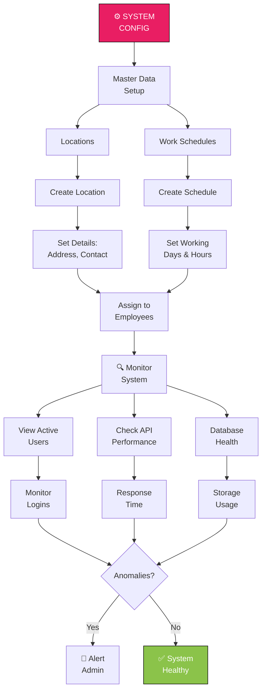

### Audit & Compliance Review
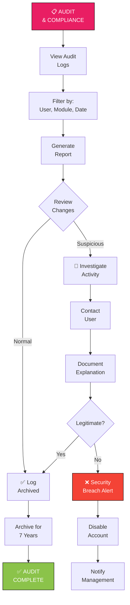

---

## 5. SUPER ADMIN WORKFLOW FLOWCHART

### Emergency Override & Crisis Management
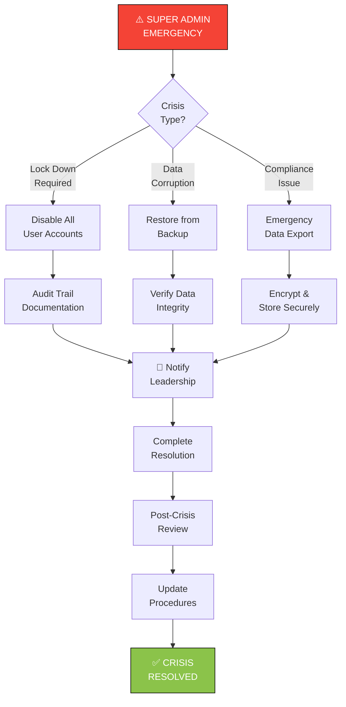

### Full System Audit & Oversight
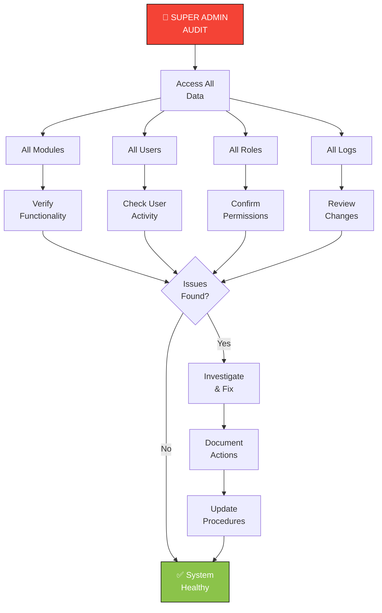

---

## Cross-Functional Integration Points

### Approval Chain Interaction
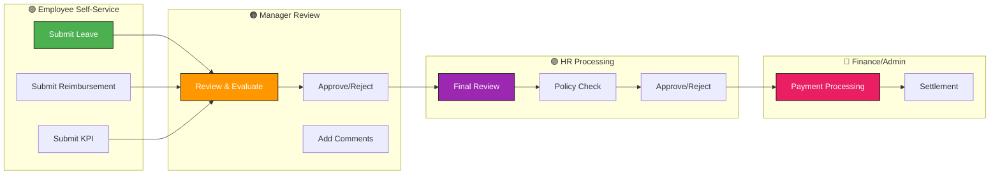

### Data Flow for Payroll Processing
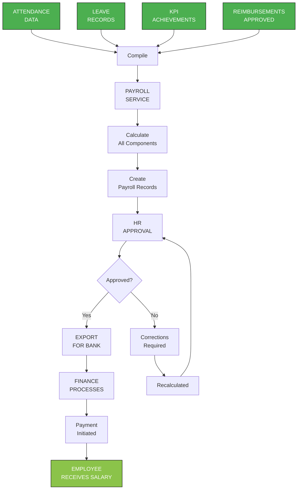

---

## Quick Reference: Decision Points

### Leave Approval Decision Matrix
```
┌─────────────────────────────────────────────────────────┐
│         LEAVE APPROVAL DECISION MATRIX                  │
├─────────────────────────────────────────────────────────┤
│                                                         │
│ Manager's Check:                                        │
│  ✓ Team coverage OK              → Approve             │
│  ✓ Leave balance available        → Approve            │
│  ✓ No conflicting approvals       → Approve            │
│  × Insufficient coverage          → Request alt dates  │
│  × Insufficient balance           → Reject             │
│  × Conflicting approvals          → Hold for review    │
│                                                         │
│ HR Final Check:                                         │
│  ✓ Policy compliant               → Approve            │
│  ✓ All docs received              → Approve            │
│  × Policy violation               → Reject             │
│  × Missing docs                   → Request & hold     │
│                                                         │
└─────────────────────────────────────────────────────────┘
```

### Reimbursement Approval Decision Matrix
```
┌─────────────────────────────────────────────────────────┐
│     REIMBURSEMENT APPROVAL DECISION MATRIX              │
├─────────────────────────────────────────────────────────┤
│                                                         │
│ Manager's Check:                                        │
│  ✓ Pre-approval existed           → Fast-track        │
│  ✓ Within policy limits           → Approve            │
│  ✓ Business purpose clear         → Approve            │
│  × Policy violation               → Reject             │
│  × Missing documentation          → Request & hold     │
│  × Excessive amount               → Request explanation│
│                                                         │
│ HR Verification:                                        │
│  ✓ Receipt authentic              → Approve            │
│  ✓ Category correct               → Approve            │
│  × Questionable receipt           → Request original   │
│  × Category unclear               → Reclassify         │
│                                                         │
│ Finance Payment:                                        │
│  ✓ Budget available               → Pay                │
│  ✓ All approvals done             → Pay                │
│  × No budget                      → Hold                │
│  × Compliance fail                → Escalate           │
│                                                         │
└─────────────────────────────────────────────────────────┘
```

---

## Status Transition Diagrams

### Leave Request Status Flow
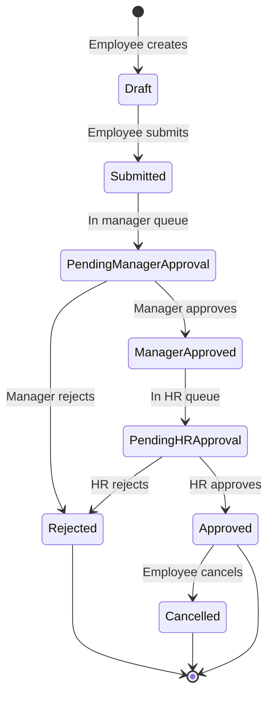

### Payroll Status Flow
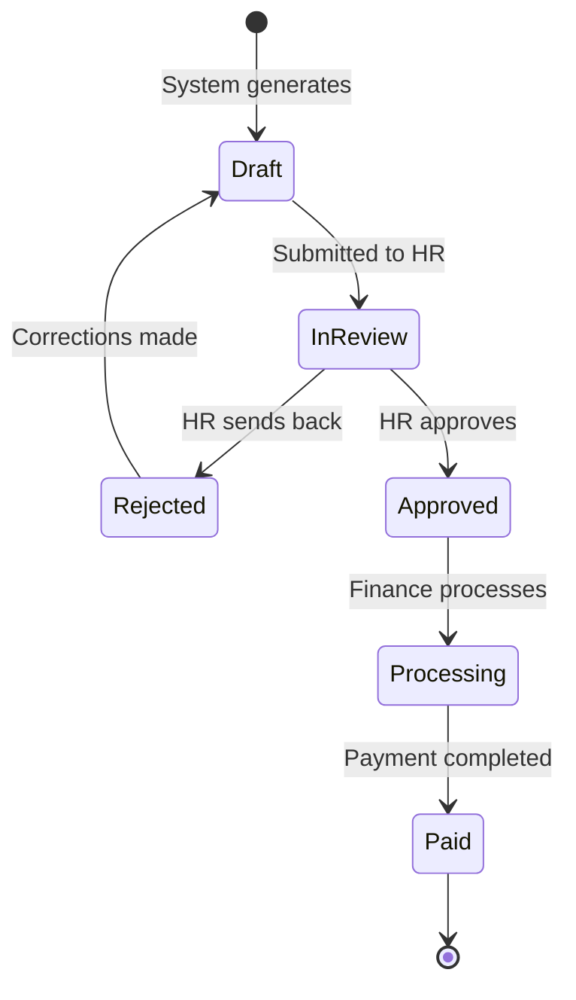

### Reimbursement Status Flow
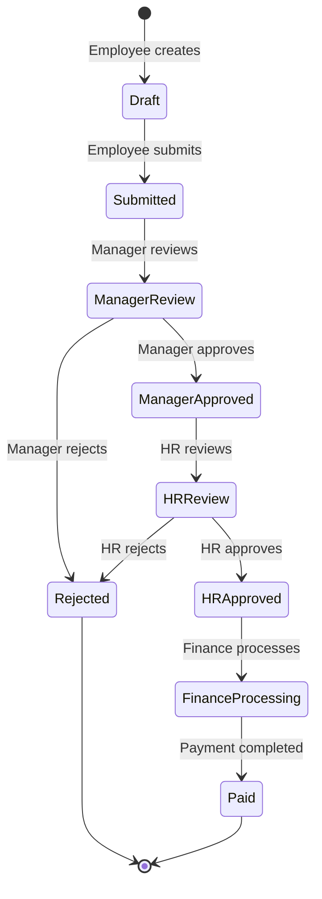

---

## Conclusion

This comprehensive visual documentation provides:
- ✅ **Clear process flows** for each role
- ✅ **Decision points** and branching logic
- ✅ **Integration points** between departments
- ✅ **Status transitions** for critical entities
- ✅ **Approval chains** with escalation paths
- ✅ **Error handling** and recovery procedures

**Ready for training and implementation!** 🚀

---

**Document Version:** 1.0  
**Last Updated:** April 2026  
**Status:** Complete & Ready for Production
