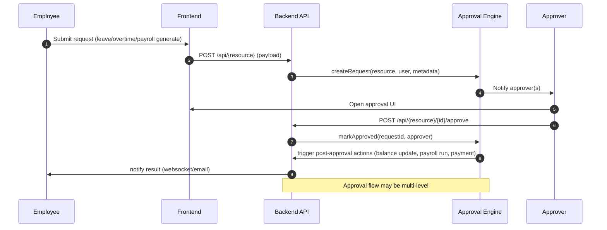
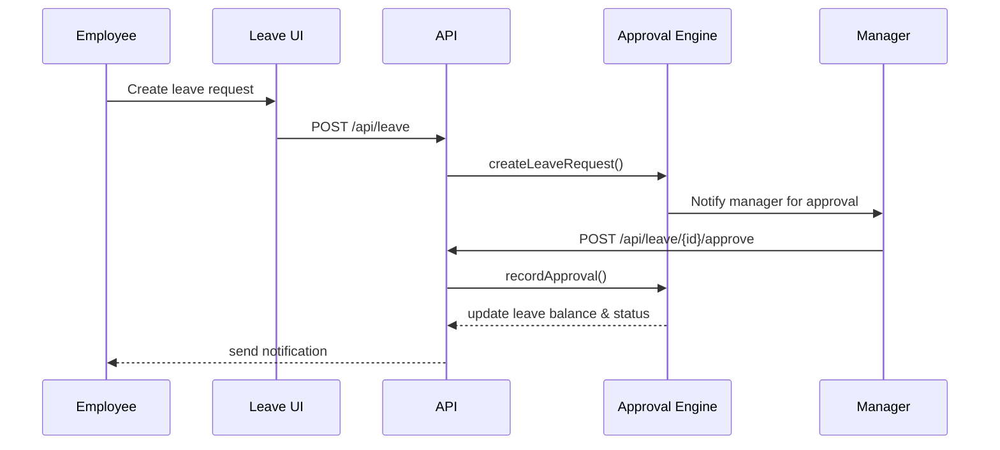
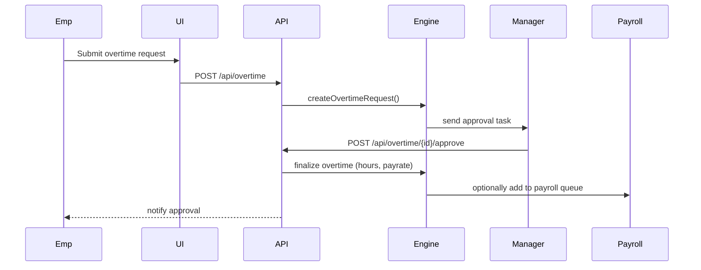
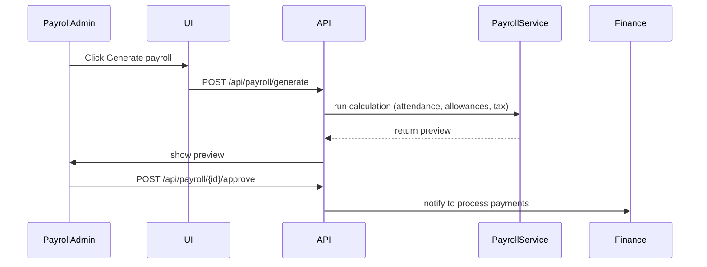

<!-- Mermaid diagrams for approval flows: Leave, Overtime, Payroll -->

Contoh untuk `Leave` flow:

Contoh untuk `Overtime` flow (manager approval):

Contoh untuk `Payroll generate` flow:

Simpan file ini di repo untuk referensi developer.
